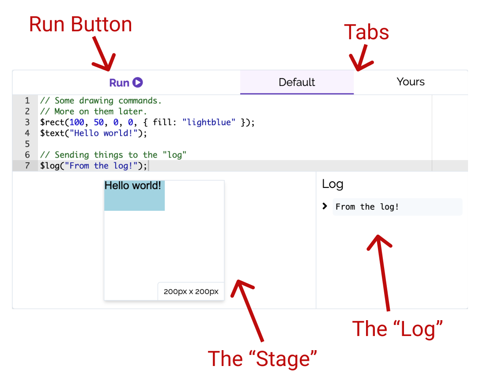

# Drawing

In this book we're going to draw computer graphics to learn about programming. [In the previous chapter](/what-is-javascript#-helpers) we saw some helpers that aren't naturally part of JavaScript per se, but we (the authors) added in by us so we can do some cool drawing stuff while learning about programming concepts. In this chapter, we'll explore some of the drawing functionalities we built into this site.

> Don't expect to understand the code in this chapter! Just pay attention to what types of drawing things we can do.

## The "Stage"

Recall that our "sandboxes" consist of some key pieces, including the "stage", which is where our drawings will show up.



You can resize the stage by dragging the edges of the stage. The size of the stage (in pixels) will show up at the bottom-right corner of the stage.

Now, let's look at some helper methods for drawing things onto the stage.

## The $log helper

We can "log" values to the screen using the `$log` helper. This helper doesn't draw anything to the stage, but instead prints some text into a "logging" area. Here's an example.

```js live=true id=drawing-log
$log("Hello world!");
$log(15 * 35);
```

Logging values well help us investigate some ideas and test things. This will sometimes be helpful for us as we explore ideas before we use those ideas in drawings.

## The $text helper

We can display text on our drawing stage using the `$text` helper. This command will take a piece of text, an x-position, a y-position, and an optional configuration, and will draw the text. Here's an example.


```js live=true id=drawing-$text
const theText = "Hello world!";
const x = 50;
const y = 100;

// Our $text helper
$text(theText, x, y, { fontSize: 24, fill: "blue" });
```

## The $circle helper

We can display circles using the `$circle` helper. This command will take a radius, an x and y position for the center of the circle, and a configuration, and will draw the circle accordingly. Here's an example.

```js live=true id=drawing-$circle
const radius = 50;
const x = $stageWidth / 2;
const y = $stageHeight / 2;

// Our $circle helper
$circle(radius, x, y, { fill: "green" });
```

## The $rect helper

We can display rectangles using the `$rect` helper. This command will take a width, a height, an x and y position for the top-left corner of the rectangle, and a configuration - and will draw the rectangle accordingly. Here's an example.

```js live=true id=drawing-$rect
const width = 100;
const height = 50;
const x = 10;
const y = 20;

// Our $rect helper
$rect(width, height, x, y, { fill: "purple" });
```

## $stageWidth and $stageHeight

You can resize the stage, so the size of the stage can actually change. We've added some helpers so you can always have access to the current size of the stage. The variable ([more on those later](/variables)) `$stageWidth` will give you the current width of the stage, and `$stageHeight` will give you the current height of the stage.

These helpers will be super useful for us, so we can draw things relative to the size of the stage! Here's an example that will put circles at each 4 corners of the stage. Try resizing the stage in the sandbox below and then rerun the code, and notice that the circles will be drawn at the corners.

```js live=true id=drawing-$stageWidth
// Top left
$circle(50);

// Top right
$circle(50, $stageWidth, 0);

// Bottom right
$circle(50, $stageWidth, $stageHeight);

// Bottom left
$circle(50, 0, $stageHeight);
```

## The $animate helper

We've also built in a helper that will animate (or change/move) items on the stage. This allows us to extend our drawings into _animations_, which will expand our drawing capabilities significantly! Here's a quick example (don't worry if the code looks confusing).

```js live=true id=drawing-$animate
const r = $rect(40, 40, 20, 20, { offsetX: 20, offsetY: 20 });

$animate({ item: r, x: $stageWidth/2, y: $stageHeight/2, duration: 1, rotation: 180, scaleX: $stageWidth/40, fill: "green" });
$animate({ item: r, scaleY: $stageHeight/40, fill: "blue", duration: 1 })
$animate({ item: r, scaleX: 0, scaleY: 0 });
$animate({ item: r, scaleX: 2, scaleY: 2, duration: 1, fill: "red", cornerRadius: 20 });
```

We can animate effectively _any_ property of our drawing objects. We'll go into depth with this helper later on. For you, just press the Run button in the sandbox above and watch the shape change!