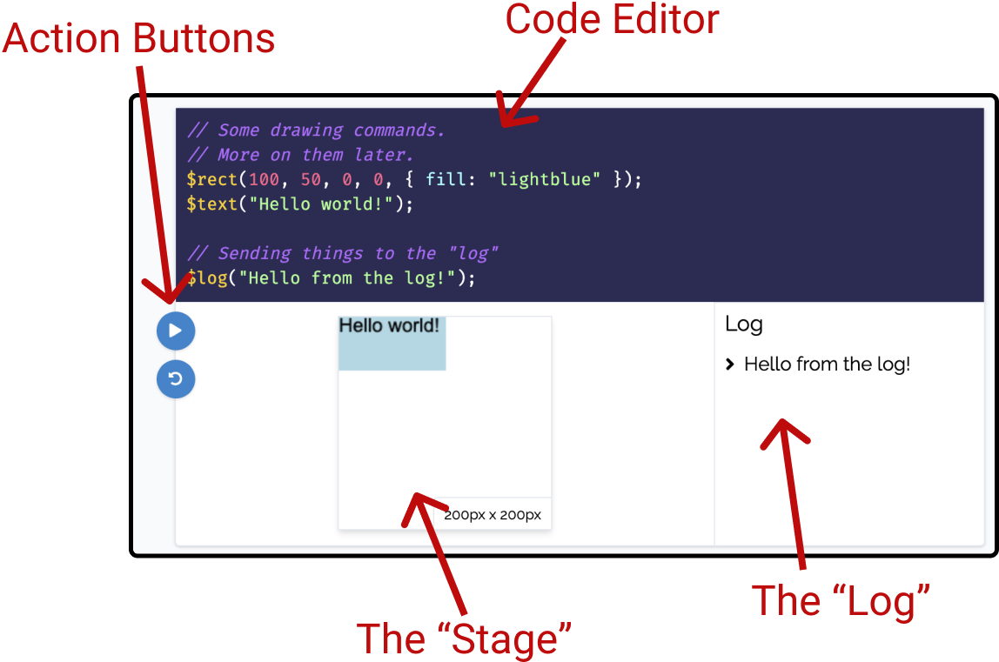
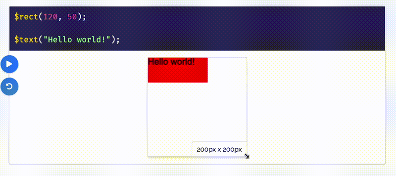

# Getting Started

This website (or "book") is all about programming! The best way to learn about programming is to _do_ programming. Therefore, there are two very important components to this book:

1. _Static_ code snippets (or examples of code). These are just for reading.
1. _Live_ code snippets. These are for interacting with!

Let's look at each of these in depth so you understand what you're looking at when you see these.

## _Static_ code snippets

The word "static" just means "lacking in action or change". Static code snippets are just pieces of code shown on the screen that you _cannot_ interact with. Here's an example:

```js
const x = 15;

if (x < 10) {
  $log("x is less than 10");
} else {
  $log("x is greater than or equal to 10");
}
```

Notice that you can highlight (and even copy) the code above. But you can't change it, and the code isn't actually being run inside of the webpage.

These static code snippets are good for presenting small bits of code and explaining what they do. However, they aren't quite as fun or useful as _live_ code snippets.

## Live code snippets

The best way to learn is to _do_. A lot of our learning in this book will revolve around us writing code to make the computer draw things for us. The best way for you to understand a piece of code is to tinker with it and see what happens when you change pieces! Therefore you will regularly see _live_ code snippets like the following:

```js live=true
// Some drawing commands.
// More on them later.
$rect(100, 50, 0, 0, { fill: "lightblue" });
$text("Hello world!");

// Sending things to the "log"
$log("Hello from the log!");
```

Let's look at this whole "live code snippet" thing. We can break this down into a few pieces:




The pieces of this are:

- The "Code Editor", which is where we'll put our code.
- The "Log", which we can send data to from our code. This will be useful as we're playing with new ideas and want to do some quick testing.
- The "Stage", which is where we all of our drawing will happen.
- The "Action Buttons", which consists of a "Play" button (the top one) and a "Reset" button (the bottom one). The "Play" button will run your code. The "Reset" button will revert the Code Editor to its original state.

Go ahead and tweak a few things in the live code snippet above, press the "Play" button, and see what happens!

## The "Log"

When programming, it's common to "log" things - or print them somewhere for us to inspect. We'll be doing something similar throughout this book! For example, suppose we told the computer to compute the value of `13 * 87`. The computer would probably do that for us, but we also need to tell it to show us the value. Check out the live snippet below.

```js live=true
// Change the line below to $log(13 * 87);
13 * 87;
```

The line

```js
13 * 87;
```

doesn't actually show us anything! Your computer is computing the value, but it doesn't know that _we want to know_ the value. Changing that to:

```js
$log(13 * 87);
```

tells the computer to _log_ the value of `13 * 87`. With that in place, you should see the value `1131` showing up in the log.

This `$log` thing you keep seeing is a _function_, and we're going to cover those in detail later on. For now, just know that if you want to log something - you can write `$log("your thing here");`.

## The "Stage"

Throughout this book we'll be telling our computer how to draw things. We'll be drawing things to a "stage". Don't worry too much about this word - it's just a word I chose. The "stage" is just the place where things will be drawn.

We will be looking at some drawing commands that are available for us. These drawing things, if used correctly, will draw things on the stage. Here's an example:

```js live=true
$rect(120, 50);

$text("Hello world!");
```

Can you figure out what the `120` and `50` in the code above mean? What happens if you change "Hello world" to something else?

Now, here's a neat trick: if you click and drag on the edges of the stage, you can actually resize it! Here it is in action:




At first, we won't be using this a whole lot. But eventually we'll do some drawing that resizes as the stage resizes. Here's a quick example of that. **Don't worry if the code doesn't make any sense!** Just resize the stage to see what's happening.

```js live=true
const width = $stageWidth / 3;
const height = $stageHeight;
const x = $stageWidth / 2 - width / 2;
const y = 0;

$rect(width, height, x, y);
```

## Code errors

Programmers make mistakes. Like, _a lot_. But it's :ok_hand:, because we're just humans - and making mistakes is part of being a human.

If you make a mistake in a live code snippet, and the computer doesn't know how to make sense of your code, you'll see an error with a message from the computer:

```js live=true
$log(COMPUTER_NO_LIKEY);
```

This will give you some indication of what you did wrong, and how you might fix it! Get used to seeing this screen - even the best of programmers make mistakes regularly while writing code! It's part of the process :+1:.
