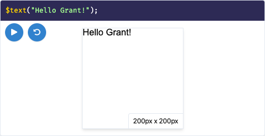

# What is Programming?

You may already have a good idea of what _computer programming_ is. _Computer programming_ (or _programming_ for short) is basically the process of telling a computer what to do, in a language it can understand.

> A computer program is a set of instructions for a computer to perform a specific task - and programming is just the process of writing these instructions.

## Our first program

Let's look at our first example. Throughout this website, we'll be telling a computer how to draw stuff on the screen. We'll start with a classic example: showing the text "Hello world!" on the screen. The thing you see below this text is an example of a computer program!

```js live=true
$text("Hello world!");
```

In the block above, you'll see some text that reads `$text('Hello world!');` and a "canvas" (or "drawing area") below it. The `$text('Hello world!');` part is our instructions to the computer, and the "Hello world!" text drawn in the white rectangle is what the computer produces after executing our instructions!

You should go play around with this example - so that you too can be an official "programmer"! Replace the world `world` with your own name in the computer instructions above, and then press the blue play button to run your program. After doing this, you should see something like the following:



## So what's the big deal?

At this point, you might be thinking to yourself, "what's the big deal?". Our first example wasn't all _that_ interesting. However, I want to point out a few important things:

- :speedboat: Computers are _fast_. Very fast. They can perform computations and other tasks much faster than a human will ever be able to. However, they need a human to tell them _what_ tasks to perform.
- :moneybag: Computers can work for \_much cheaper* than humans. Remember the thing about computers being fast? It means they can do _certain_ work much faster, and hence much cheaper, than humans. They still need a human to tell them what to do.
- :rocket: At this point in time, there is _a lot_ that computers can do, from simple math computations, to providing interfaces for you to connect with your friends, to guiding spaceships. Learning a little about programming opens a lot of doors!

## What is a programming "language"?

Picture yourself having a conversation with your friend. You are both just making weird noises with your mouth. However, you both know how to make sense of these weird noises! Therefore, you two can communicate ideas to one another. This is what we call a _language_: a structured method of communicating ideas.

If you're reading this book, chances are you speak English - a language that you and I both understand and can use to communicate. However, computers don't speak in English (yet)! We can't just yell words at our computer and expect it to do things for us (although that'd be funny if we could). We need a way of _communicating_ with the computers so that we know how to tell the computer what to do, and the computer knows how to make sense of the instructions we're giving it. We need a _language_!

> A _programming language_ is a language that humans can write and computers can make sense of.

There are _a lot_ of programming languages out there already! Each language has its own strengths and weaknesses, and is generally used for some specific set of tasks. In this book, we're going to be using a programming language called _JavaScript_, which we'll learn about in the next chapter!
